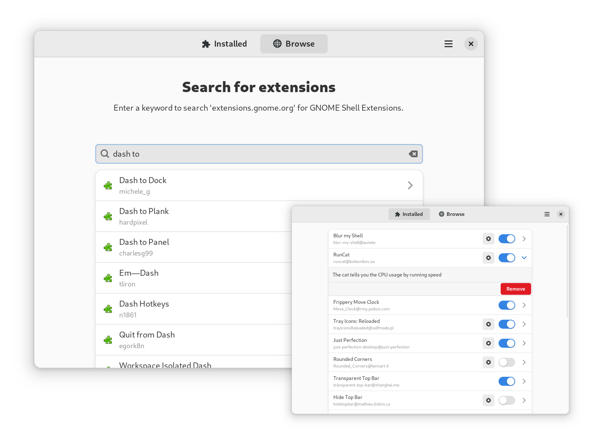

# Extension Manager
A native tool for browsing, installing, and managing GNOME Shell Extensions.

Written with GTK 4 and libadwaita.

## Features
The tool supports:
 - Browsing and searching extensions from `extensions.gnome.org`
 - Installation
 - Enabling and Disabling
 - Uninstall
 - Translations ([help wanted!](https://github.com/mjakeman/extension-manager/issues/27))
 
Things that are not yet supported:
 - Updating extensions in-app
 - Screenshots &amp; Images
 - Ratings &amp; Comments

If there's something you'd like to see, contributions are welcome!

## Installing
Flatpak is the recommended way to install Extension Manager. 

You can get the latest version from flathub by clicking the button below. There
may also be independently-maintained packages available for your distribution.

## Building
The easiest way to build is by cloning this repo with GNOME Builder. It
will automatically resolve all relevant flatpak SDKs automatically.

If you run into issues, make sure you have the [`gnome-nightly`](https://wiki.gnome.org/Apps/Nightly)
flatpak repository installed.
